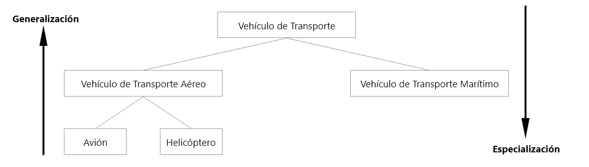
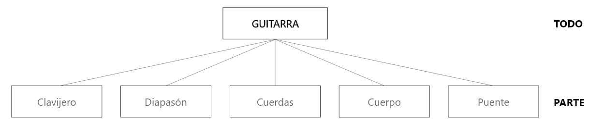

# Mecanismos de abstracción

## Abstracción de clasificacion

La abstracción de clasificación nos permite percibir que los objetos de la realidad están organizados como **clases** o **tipos de objetos**, caracterizados por propiedades comunes. *Todo objeto pertenece a alguna clase de objetos*. Por ejemplo, tenemos la clase de objetos *reloj*; esta clase de objetos tienen características comunes, así tienen: una forma, un color, sirven para dar la hora, etc. Los objetos o instancias de esta clase son: El reoj de la catedral, el relok de Melina, el reloj rojo, etc.

El mundo real esta formado por objetos. Todo objeto pertenece por lo menos a una **clase** de objetos. Un objeto puede pertenecer a más de una clase de objetos, dependiendo de la perspectiva y la interpretación que le de el observador.

El objeto "Ana Paz" puede pertenecer a la clase de objetos "Alumno" desde la perspectiva de un sistema académico universitario, pero también pertenece a la clase de objetos "Paciente" desde la perspectiva de un sistema de seguro médico.

## Abstracción de generalización - especialización

Una **abstracción de generalización** define que los objetos de una o más clases puedan aun pertenecer a otra clase más genérica. Por ejemplo los objetos de clase *Avión* y de la clase *Helicóptero* pertenecen a su vez a una clase más genérica *Vehículos de transporte aéreo*. Esta clase conjuntamente con las clases *Vehiculos de transporte terrestre* y *Vehiculos de transporte marítimo* pertenecen aún a otra clase más genérica como es la clase *Vehículo de transporte*.

Se pueden también ver desde otra perspectiva, como una **abstracción de especialización**, que define que los objetos de una clase pueden aún subdividirse en clases de objetos más específicos. Por ejemplo, en el contexto la universidad la clase *Persona*, puede especializarse en clases *Alumno*, *Docente* y *Personal Administrativo*.

En resumen, la **abstracción de generalización - especialización** nos permite percibir que los objetos de la realidad se organizan en clases y subclases, es decir, se organizan en una estructura jerárquica, aunque son dos puntos de vista distintos de la misma jerarquía.

La clase de mayor jerarquía *"Vehículo de Transporte"* representa todas las características o atributos comunes a todos los vehículos de transporte; mientras que la clase *"Vehículo de Transporte Aéreo"* tiene atributos especificos que no tiene la clase *"Vehículos de Transporte Marítimo"* pero si tiene atributos que tienen todos los vehículos de transporte aéreo, como los aviones y los helicópteros; asi mismo, la clase *"Avión"* tiene atributos específicos que no tiene la clase *"Helicóptero"*

La abstracción de generalización es muy importante en el modelo de objetos, porque es la base para el concepto de **Herencia**.

## Abstracción de agregación

Si se hace un análisis más minucioso de los objetos del mundo real, se puede constatar que muchos de estos objetos. Así, un objeto de la clase COMPUTADOR esta formado por objetos de las clases TARJETA MADRE, MICROPROCESADOR, MEMORIAS, etc. Luego la abstracción de agregación es la representación del **"todo y sus partes"**.

